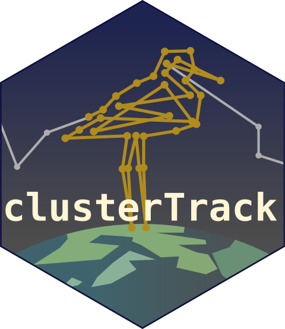

clusterTrack <a href="https://ornitho-logics.github.io/clusterTrack/"></a>

[](https://github.com/ornitho-logics/clusterTrack/actions/workflows/pkgdown.yaml)
[](https://github.com/ornitho-logics/clusterTrack)
[](https://www.gnu.org/licenses/old-licenses/gpl-2.0)
[](https://github.com/ornitho-logics/clusterTrack/commits/main)


`clusterTrack` identifies spatiotemporally distinct use sites from animal telemetry tracks.

The package is designed for relocation data where animals alternate between local site use and movement, often with irregular sampling, location error, and repeated returns to the same places. It combines temporal track segmentation, local spatial clustering, and iterative repair procedures to identify and label use sites.

`clusterTrack` works with both lower-precision telemetry data such as ARGOS and high-resolution GNSS tracks.


See also [`clusterTrack.Vis`](https://github.com/ornitho-logics/clusterTrack.Vis), the extension package for `clusterTrack`.

## Installation

You can install the development versions from GitHub with:

``` r
remotes::install_github('ornitho-logics/clusterTrack')
remotes::install_github('ornitho-logics/clusterTrack.Vis')
```
