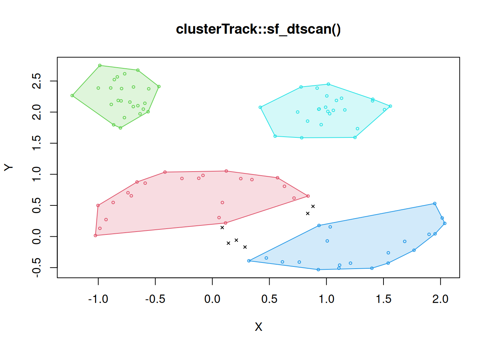

# Clustering tracks: basic examples

This vignette uses small synthetic tracks to illustrate the core
behaviour of `clusterTrack`. The examples are kept simple: they are not
intended as realistic movement simulations, but as simple cases that
isolate how the algorithm responds to spatial separation, temporal
ordering, revisitation, and variation in local point density.

The objects inferred by clusterTrack are clusters that are distinct in
both space and time.

## Space and time separation

The simplest case is a track that moves from one concentrated region to
another, with the two regions separated both spatially and temporally.
Here, spatial discontinuity and temporal ordering provide consistent
evidence for two distinct clusters.

## Space separation, time mixing

Spatial separation alone is not sufficient to define independent
clusters. In this example, two spatially distinct point clouds have
overlapping time domains, so they do not represent two temporally
ordered parts of the track.

## Space recurrence, time separation

A track can return to the same spatial region after visiting another
region in between. These revisits are retained as separate clusters when
they are separated in time, even if their spatial footprints overlap.

## Clusters with different densities

Because segmentation turns clustering into a local problem, thresholds
are estimated locally rather than set globally. This allows
`clusterTrack` to accommodate clusters with different sampling
densities.

## Spatial clustering with `sf_dtscan()`

`clusterTrack` uses Delaunay-based spatial clustering internally, but
the spatial clustering step can also be run directly with
[`sf_dtscan()`](https://ornitho-logics.github.io/clusterTrack/reference/sf_dtscan.md).
This is useful when the goal is to cluster some data without using
temporal information, or when inspecting how the spatial component
behaves before applying the full track-level workflow.

The example below uses the `moons` dataset from `dbscan`. The dataset
was artificially created as two crescent moons and two compact blobs.
With the default settings,
[`sf_dtscan()`](https://ornitho-logics.github.io/clusterTrack/reference/sf_dtscan.md)
recovers four clusters in this case.

